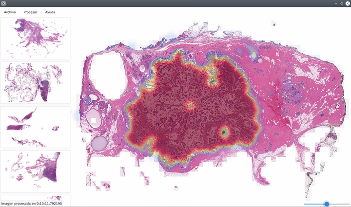

# HistopathApp
## This repository is currently under development!

HistopathApp is a simple application which allows to visualize histopathology images and apply an AI algorithm to them in order to detect the tissue containing cancer cells.\
For the moment it only support images in conventional formats, such as JPEG, and PNG. However it is aimed to add support to formats used in histhopathology images which contain the same image at different resolutions levels.\
The application is developed using Python, the Qt Framework and the PySide2 wrapper for Python. The app distribution is bundled using PyInstaller.\

# How to set up the project
First, you should have installed a Python 3 interpreter in your local machine.\
The clone the repository using the `git clone` command.\
Navigate to the project folder.\
Create a Python Virtual Environment using `python3 -m venv ./venv/` which will create a new virtual environment placed in venv folder inside the project root.\
Finally, install the project requirements using `pip install -r requirements.txt`
\
To bundle the application using PyInstaller execute `pyinstaller main.spec`
